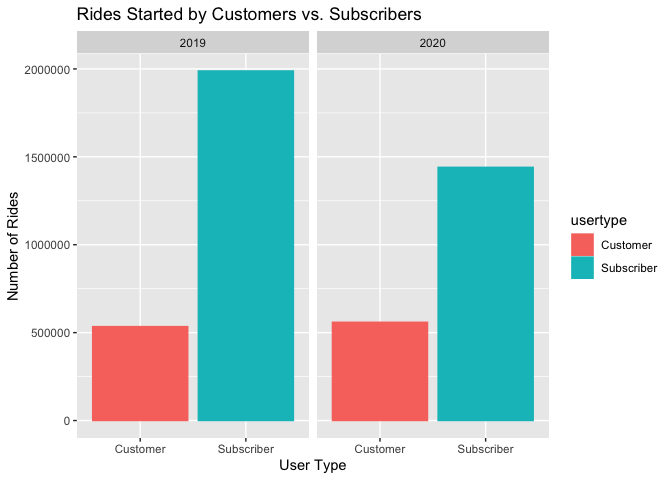
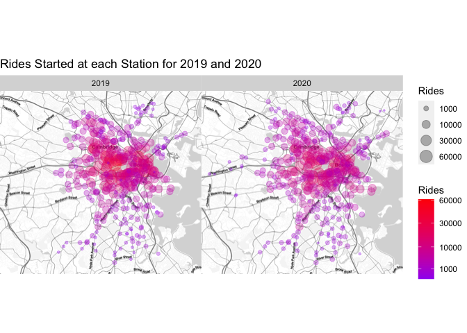
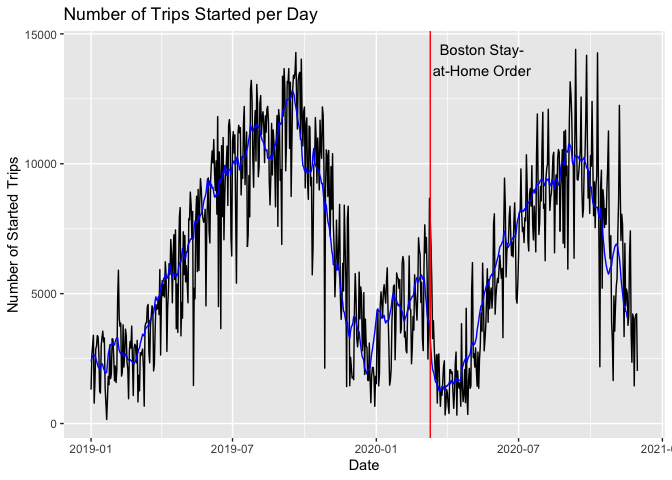
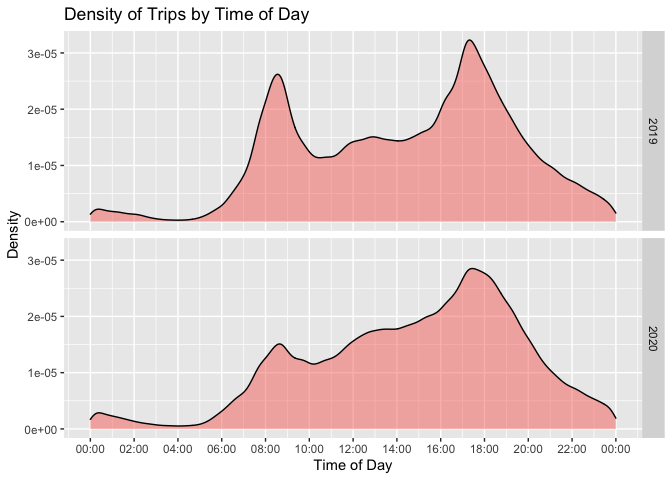
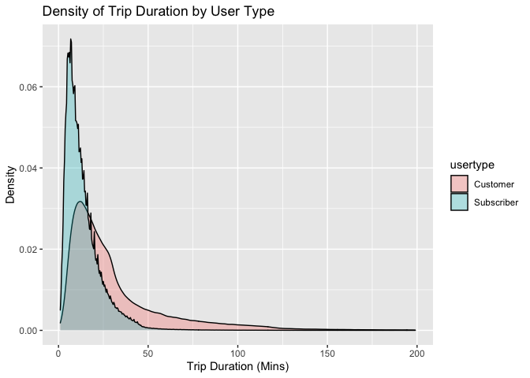
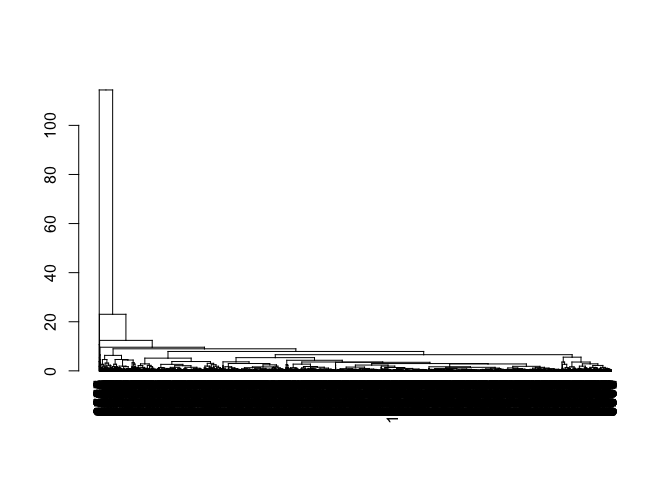
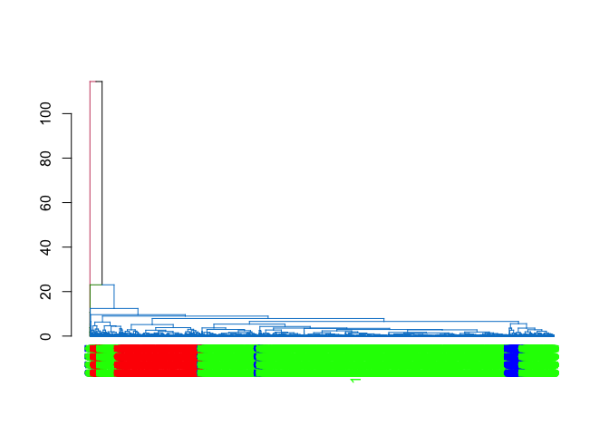
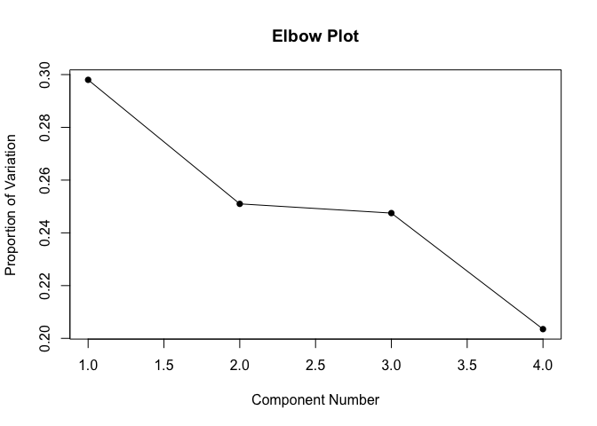
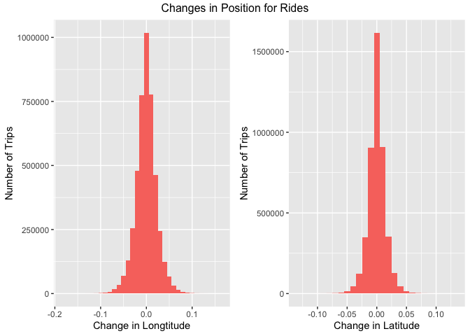
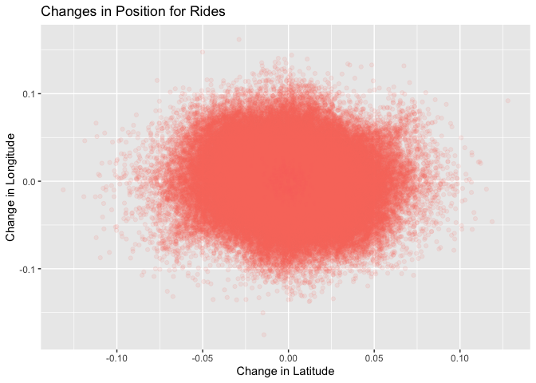

Final Project Report
================
Keltin Grimes, Charly Jin, Yirui Deng
12/13/2021

## Introduction

### The Dataset

BlueBikes is a bikesharing company operating in the larger Boston area.
The company has constructed docking stations around the city and has
provided bikes for users to rent. Users can pay to check-out a bike from
any station, ride it, and must return it to any other station. Also,
bike users are classified as Customers or Subscribers. Customers pay a
one-time fee to rent a bike for a single trip, and Subscribers pay a
monthly or annual membership fee for unlimited rides shorter than 45
minutes.

In our dataset, we have 18 variables and 4522217 observations for every
single bike trip taken through 2019 and most of 2020. For each
observation, our data is split into three parts: the trip data, the
start and end station data, and the rider data. For each trip we have
the exact start and end time for the trip, the duration of the trip in
seconds, the bike id, and the year and month of the trip. For both the
starting and ending station, we have the station’s unique ID, name,
latitude, and longitude. For the rider, we have their birth year,
gender, residence postal code (for 2020 data only), and whether they
purchased the ride as a Customer or Subscriber.

### Research Questions

Throughout our report we seek to answer three main research questions
using the dataset.

-   In what ways did the COVID19 pandemic affect ride patterns?
-   In what ways do customers and subscribers interact differently with
    the bikes?
-   How far away should each bike station be from each other (in order
    to maximize business efficiency)?

# Analysis

We wanted to explore the difference between Customers and Subscribers
and analyze how the COVID19 pandemic affected riders. To do this we
chose to look at the number of rides started by each type of customer.
For simplicity we consider 2019 to be pre-pandemic, and all of 2020 to
be part of the pandemic.

<!-- -->

The above bar plot shows the conditional distribution of the number of
rides started by each user type, given the year in which the rides were
started. The first important point shown by this graph is that the
number of overall rides decreased by about 500,000 from 2019 to 2020.
This is the key observation for our first research question, as it
demonstrates that the BlueBikes business fell during the pandemic. We
can also see that for both 2019 and 2020, there were many more
Subscriber rides than Customer rides. The number of Customer rides
slightly increased from 2019 to 2020, but there was a large drop in the
number of Subscriber rides. This suggests that BlueBikes lost a lot of
subscribers during the pandemic, or that subscribers just generally took
fewer trips. We hypothesize that Subscribers are generally people who
commute to work, and with many people being forced to work from home due
to the pandemic, it is not surprising that there was a large drop in the
number of rides by Subscribers. Additionally, we hypothesize that the
increase in Customer rides is due to more people using the bikes for
leisure, as biking is a fun and safe way to get out of the house during
the pandemic when many people were stuck at home for long periods of
time. We also see that only roughly a quarter of the riders are
customers while the rest are subscribers.

  
  

We have seen that fewer rides were taken in 2020 compared to 2019, but
we wanted to see if there were any spatial differences in where the
rides were taking place across the two years, in order to further
analyze our first research question. To do this we examine the number of
rides started at each unique docking station.

<!-- -->

The above map has a circle centered at each unique bike station that had
at least one ride start from it. The size and color of the circle is
proportional to the square root of the number of rides started at that
station in the given year. In downtown Boston, where the most used bike
stations are, we can see that the stations were used much more
frequently in 2019 compared to 2020. We believe this provides more
evidence to suggest that a lack of commuters were responsible for the
decrease in rides during the pandemic, as downtown Boston is dominated
by businesses instead of residents, at least compared to suburban
Boston. We can also see that there are a number of stations present in
2020 but not in 2019, especially in the areas farther from downtown,
showing BlueBikes was still preparing for future growth by building new
stations even in the pandemic. The graphs shows that a number of more
rural stations actually had more riders in 2020, demonstrating that due
to the pandemic, users were forced to stay home.

  
  

Since the start and end of each ride is time-stamped, we can do more
fine-grained time series analysis than just comparing the years in order
to further answer the first research question. To see how the number of
rides changed throughout the two years, we can examine the number of
rides started on each day.

<!-- -->

We have shown the number of rides started each day in black, along with
a 14-day rolling average in blue. We can see that the number of daily
rides is fairly low in the winter months, and peaks in late summer. This
seasonal trend is unsurprising, as riding bikes in the cold and snow is
often not enjoyable or convenient, and Boston gets quite cold and snowy
in the winter. The red line denotes the day the Governor of Boston
issued a Stay-at-Home order to the city in order to mitigate the spread
of COVID-19, and we can see there is a dramatic fall in the number of
rides following it. Most of the days with the fewest number of rides
occurred in the month following the shutdown. It appears that the number
of rides struggled to come back from the dip, as the 2020 summer peak in
the rolling average was noticeably less than the one in 2019. Another
interesting feature of this plot is the increase in rides starting just
before New Years 2020, and ending at the Stay-at-Home order. This
increase is likely due to the City of Boston offering all hospital
workers a free 30-day BlueBikes pass.

  
  

So far we have been hypothesizing that the biggest change in rides from
2019 to 2020 was a large decrease in commuters during the pandemic. We
would like to collect some more evidence to support this claim and in
turn shed more insight onto our first research question. We will do this
by examining the time of days in which rides were started for before and
during the pandemic.

<!-- -->

We have extracted the time of day that each ride was started, and we
plot the density of rides over the course of the day, dividing the rides
by whether they started in 2019 or 2020. As we would expect, most of the
rides occur during the day, and there are few rides late at night. The
morning and evening “rush hour”, the time when most workers commute to
and from work, are generally considered to be around 8-9 A.M. and 5-6
P.M., and we can see that in 2019 there are two very sharp peaks in the
density during both these times. In 2020, the morning rush hour peak is
significantly smaller, and the evening rush hour peak is there but more
muted. This provides strong evidence to suggest that rides during the
pandemic shifted away from commutes towards leisure or other one-off
rides.

  
  

Our first plot demonstrated some changes in Customers and Subscribers
rides across 2019 and 2020, but we would like to explore some other
interesting differences in the two groups. To do this, and examine our
second research question, we will compare how Customers and Subscribers
interact with the bikes through the use of a density graph of trip
duration.

<!-- -->

From our data, we see that the distribution of trip duration is fairly
different depending on the user type. The trip duration for Subscribers
is generally less than 30 minutes, and almost no customers use their
bikes for more than an hour. Customers also often use their bikes less
than 30 minutes, but a significant portion of the distribution is skewed
to the right because there are many people who use a bike for longer
than 30 minutes. We conducted a KS test, and found that the
distributions are significantly different for an alpha equal to 0.05.
This graph helps reveal that there are significant differences in the
trip duration between customers and subscribers. This may be because
subscribers usually rent the bikes for commuting to and from places, so
they have shorter trips compared to many customers who ride for long
leisure trips.

temp:
<!-- --><!-- -->

    ## Importance of components:
    ##                          PC1   PC2    PC3    PC4
    ## Standard deviation     1.092 1.002 0.9950 0.9022
    ## Proportion of Variance 0.298 0.251 0.2475 0.2035
    ## Cumulative Proportion  0.298 0.549 0.7965 1.0000

<!-- -->

  
  

Our approach to solve the third research question is to analyze consumer
behavior by calculating the changes in longitude and latitude of every
trip. If the majority of these trips fall within a very small range of
longitude or latitude, we would recommend BlueBikes to refrain from
setting up stations that are smaller than this range (being too close to
each other) since that will increase the operational cost and take up
extra public space.

<!-- -->

The first histogram above shows that the majority of the change in
longitude is within 0.025. We took out extreme values that were probably
the results of errors. The second histogram above shows that the
majority of the change in latitude is within 0.015. Similarly, we also
took out outliers that looked very suspicious.

    ##       Min.    1st Qu.     Median       Mean    3rd Qu.       Max. 
    ## -0.1753980 -0.0129633  0.0000000 -0.0003017  0.0123971  0.1619942

    ##       Min.    1st Qu.     Median       Mean    3rd Qu.       Max. 
    ## -1.313e-01 -7.624e-03  0.000e+00  7.282e-05  7.822e-03  1.279e-01

Using summary statistics produced by R to double check our numbers, we
have confirmed that our numerical estimations are correct since the
differences between 1st quartile and 3rd quartile for longitude and
latitude is about 0.025 and 0.015 respectively.

  
  

<!-- -->

The ggplot above confirms that most trips fall within these ranges
because it is a spherical shape that has a center (even though it is
pretty big). This is to make sure that it is not the case when longitude
gets smaller, latitude gets too extreme or when latitude gets smaller,
longitude gets too extreme.

# Main Conclusions

This dataset provides information on nearly all BlueBikes trips in 2019
and 2020. We sought to use it to answer a few main research questions
that would be useful to improve BlueBikes’ business. First, we wanted to
analyze how COVID19 pandemic affected biking patterns. We had four
visualizations that illustrated this and the results were interesting.
COVID19 has affected users in multiple ways from the amount of users to
even the time of day of biking. Although the number of customers
slightly increased during the pandemic due to leisure riding, the number
of subscribers dropped by a significant amount. From rolling averages,
we also saw that the number of users suddenly dropped due to a stay at
home order and the 2020 peak was not as high as the 2019 peak. Bike
activity around stations decreased as a whole, but increased slightly in
rural areas due to closing of urban businesses. Even the rush hour for
biking was muted in 2020 due to more people working from home than
usual.

Second, we wanted to see differences in bike patterns between customers
and subscribers. We used multiple visualizations to see that customers
are only about a third of the subscribers. Not only do the subscribers
out number the customers, they also use bikes for slightly different
purposes. The trip duration for subscribers are generally short and less
than an hour, while the trip duration for many customers are longer.
This may be due to the subscribers using bikes to commute generally,
while many customers also use the bikes for long leisure journeys.

Third, we wanted to see how far away bike starts should be from each
other to maximize business efficiency. In most scenarios, the difference
in longitude between each station should be around 0.025, and the
difference in latitude should be around than 0.015, as these numbers
would satisfy most people’s needs while minimizing the amount of
stations present, saving more space and decreasing business cost.

Overall, we enjoyed analyzing and visualizing the dataset due to our
interest in applying statistics to everyday tasks such as biking. The
results we have found are helpful for deciding the directions of growth
for bike sharing businesses in the future. Although we have made
significant conclusions, there are still many unanswered questions left
to explore. In future work, we could try to classify users based on some
of their data. This was not explored in our project because there was
not any user data for trips made in 2019, and due to the enormous size
of our dataset, running classification models will always time out.
Analyzing patterns of distance may be helpful in knowing when to
maintain the bikes, but it is out of the scope of our project because we
only have access to the trip duration and displacement instead of
distance.
